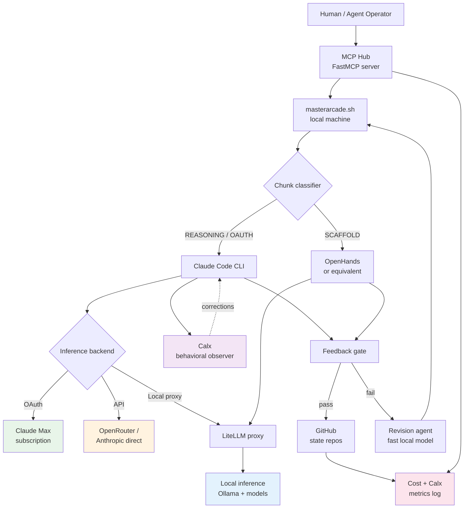

# ARCADE — Advanced Setup

For users deploying at Standard or Distributed tier: model routing, local inference,
secrets management, agent integration, and the distributed architecture overview.

---

## LiteLLM proxy

LiteLLM sits between ARCADE and your inference providers. It handles model alias
translation, fallbacks, spend logging, and routing to local Ollama. Once deployed,
Claude Code never needs to know which actual model it's calling.

### Why the alias map matters

Claude Code sends specific model strings (`claude-sonnet-4-6`, `claude-sonnet-4.6[1m]`)
that change with releases. The alias map absorbs any variant and routes it to your stable
internal name. When Anthropic releases a new model, you update one line in LiteLLM config
— not every script.

### Model aliases — user-defined

Users define their own model aliases in their LiteLLM config. ARCADE reads whatever
`ANTHROPIC_BASE_URL` and `ANTHROPIC_API_KEY` point to — the alias map is entirely
user-managed. Define aliases that match your available models and infrastructure.

Example config structure (fill in your own model names):

```yaml
litellm_settings:
  drop_params: true
  model_alias_map:
    "claude-sonnet-4-6":          "my-reasoning-model"
    "claude-sonnet-4.6":          "my-reasoning-model"
    "claude-sonnet-4.6[1m]":      "my-reasoning-model"
    "claude-haiku-4-5":           "my-scaffold-model"
    "claude-haiku-4.5":           "my-scaffold-model"

router_settings:
  fallbacks:
    - {"my-coder": ["openrouter-free"]}
  num_retries: 1

model_list:
  - model_name: my-reasoning-model    # your alias — use this in ARCADE config
    litellm_params:
      model: openrouter/YOUR_PREFERRED_REASONING_MODEL
      api_base: https://openrouter.ai/api/v1
      api_key: os.environ/OPENROUTER_API_KEY

  - model_name: my-scaffold-model
    litellm_params:
      model: openrouter/YOUR_PREFERRED_SCAFFOLD_MODEL
      api_base: https://openrouter.ai/api/v1
      api_key: os.environ/OPENROUTER_API_KEY

  - model_name: my-coder             # user-defined alias for local coder model
    litellm_params:
      model: ollama/YOUR_LOCAL_CODER_MODEL
      api_base: http://your-ollama-host:11434
      think: false

  - model_name: my-classifier        # fast small model for classification
    litellm_params:
      model: ollama/YOUR_LOCAL_FAST_MODEL
      api_base: http://your-ollama-host:11434
      think: false
```

### Connecting ARCADE to LiteLLM

```bash
# In arcade.conf
ANTHROPIC_API_KEY="your-litellm-master-key"
ANTHROPIC_BASE_URL="http://your-litellm-host:4000"
LITELLM_MASTER_KEY="your-litellm-master-key"
LITELLM_URL="http://your-litellm-host:4000"
```

---

## Local inference with Ollama

### Why local models

- Scaffold tasks (file gen, boilerplate, format conversion) don't need frontier-model reasoning
- Local models via Ollama run at LAN speed for zero token cost
- Classification and revision calls are cheap either way — local models eliminate them entirely

### Model tier roles

Model availability and rankings change rapidly. The following describes the functional
roles; consult current [Ollama model listings](https://ollama.com/library) and
[OpenRouter's model directory](https://openrouter.ai/models) for current recommendations.

| Role | Parameter range | Examples (illustrative — not prescriptive) |
|---|---|---|
| Fast classifier / revision | 0.5B–1.5B | Small, fast instruct models |
| Scaffold / code generation | 7B–14B | Capable open-source coder models |
| General reasoning | 30B+ | Large reasoning-capable models |
| Vision tasks | varies | Multimodal models with vision support |

Note: specific model names are intentionally omitted. Rankings, capabilities, and
availability evolve faster than documentation. Always evaluate against your current use case.

### Add to LiteLLM config

```yaml
  - model_name: your-coder-alias
    litellm_params:
      model: ollama/YOUR_CODER_MODEL
      api_base: http://your-ollama-host:11434
      think: false

  - model_name: your-classifier-alias
    litellm_params:
      model: ollama/YOUR_FAST_MODEL
      api_base: http://your-ollama-host:11434
      think: false
```

### Chunk classification

When a local model alias is available and `LUMINA_URL` is configured, `classify.sh`
calls it for binary REASONING/SCAFFOLD classification. If no model is reachable, it falls
back to keyword heuristics (accurate for most tasks).

---

## OpenHands execution tier

OpenHands is the reference implementation for ARCADE's SCAFFOLD execution layer. Claude
Code delegates scaffolding work to it via an MCP tool call — the ARCADE iteration
continues normally while OpenHands handles the mechanical work.

**Note:** OpenHands is not the only option. Any tool that can receive a task description
and a working directory and return file changes can fill this role. The interface contract
is minimal: task description in, modified files out. Alternative tools worth evaluating
include Aider, Sweep, and similar agentic coding tools. The `openhands_run_task` MCP tool
would need to be replaced with an equivalent wrapper for the chosen tool.

### What OpenHands handles

- File generation and boilerplate
- Dependency installation
- Build runs
- Format conversion
- Any task Claude Code classifies as SCAFFOLD

### Setup

1. Install OpenHands on the same machine as Claude Code
2. Point it at your local inference model (via LiteLLM or direct Ollama)
3. Deploy `openhands_run_task` MCP tool (see MCP section below)
4. Add to `CLAUDE.md`: delegate scaffolding tasks via `openhands_run_task`

### Cost impact

Every task OpenHands handles with a local model burns zero API tokens. For projects where
40-60% of work is scaffolding, this halves API spend.

---

## Credentials and secrets

ARCADE reads credentials from environment variables and `arcade.conf`. How those variables
are populated is the user's responsibility.

Common approaches:
- **Plain `arcade.conf`** — simplest, suitable for single-user setups. `arcade.conf` is gitignored.
- **Secrets manager CLI** — inject at shell startup or in a wrapper script. Tools like HashiCorp Vault, 1Password CLI, AWS Secrets Manager, and Bitwarden CLI all support exporting secrets as environment variables. ARCADE does not depend on any specific tool.
- **Secrets injection in your agent framework** — if ARCADE is managed by an agentic system, the agent framework's credential handling applies.

Variables ARCADE reads (from `arcade.conf.example`):

```
ANTHROPIC_API_KEY, ANTHROPIC_BASE_URL    — inference backend
OPENROUTER_API_KEY                       — OpenRouter balance checks
LITELLM_MASTER_KEY, LITELLM_URL          — LiteLLM spend logging
GITHUB_URL, GITHUB_TOKEN, GITHUB_ORG     — state repo management
ARCADE_STATE_ROOT                        — where project state lives
ARCADE_MAX_BUDGET_USD                    — per-session spend cap
ARCADE_MIN_BALANCE_USD                   — minimum balance before halting
MAX_ITERATIONS                           — attempts per chunk before revision
CALX_VENV                                — path to getcalx venv
```

---

## MCP deployment options

### ARCADE MCP tools

An MCP server running alongside ARCADE allows agents to manage projects programmatically:

| Tool | Parameters | Description |
|---|---|---|
| `arcade_init_project` | project: str | Creates repos, copies prep files, sets up state directory |
| `arcade_start_project` | project: str, mode: str | Launches session. Returns session name. |
| `arcade_get_status` | project: str | Returns current chunk, last exit, open issue count |
| `arcade_list_projects` | none | Returns all projects with status summary |
| `arcade_add_task` | project: str, task: str | Appends task to queue.md |
| `arcade_get_cost` | project: str, scope: str | Cost for last_run / session / all_time |
| `arcade_get_balance` | none | OpenRouter balance and sessions remaining |

### OpenHands MCP tool

| Tool | Parameters | Returns |
|---|---|---|
| `openhands_run_task` | task: str, working_dir: str | result summary, exit status, files modified |
| `openhands_get_status` | task_id: str | running / complete / failed + progress |

### FastMCP server (Python)

```python
from fastmcp import FastMCP
import subprocess

mcp = FastMCP("arcade")

@mcp.tool()
def arcade_get_status(project: str) -> dict:
    """Get current status of an ARCADE project."""
    state_dir = f"{ARCADE_STATE_ROOT}/{project}"
    run_log = open(f"{state_dir}/run-log.md").read()
    issues = open(f"{state_dir}/issues.md").read()
    return {"run_log": run_log[-2000:], "issues": issues}

@mcp.tool()
def arcade_start_project(project: str, mode: str = "reasoning") -> dict:
    """Launch an ARCADE session in tmux."""
    cmd = f"tmux new-session -d -s arcade-{project} 'cd {ARCADE_ROOT} && ./masterarcade.sh --project {project} --mode {mode}'"
    result = subprocess.run(cmd, shell=True, capture_output=True, text=True)
    return {"session": f"arcade-{project}", "status": "launched" if result.returncode == 0 else "failed"}
```

### Deployment options

**Local FastMCP (reference implementation):** Runs on the same machine or a dedicated LAN
node. Managed manually. Suitable for Simple and Standard deployments. No external
dependencies.

**Self-hosted with reverse proxy:** Expose a local FastMCP instance externally via
Cloudflare Tunnel, ngrok, or a standard reverse proxy. Enables remote agent access without
a hosted service. Scope credentials carefully.

**Third-party hosted MCP platforms:** Services such as mcp.run, Smithery, and similar
platforms host MCP servers without self-managed infrastructure. Review tool scoping and
credential handling carefully — hosted MCP servers have access to whatever credentials you
provide.

**Project backlog:** Automated FastMCP deployment (playbook or container) is not currently
implemented. Deployment is manual. Contributions welcome.

---

## Persistent state on a shared drive

By default ARCADE uses `~/.arcade/projects/`. For resilience across machine rebuilds,
point it at a shared directory:

```bash
# In arcade.conf
ARCADE_STATE_ROOT="/mnt/shared/arcade/projects"
```

State is also synced to the `arcade-{project}` GitHub repo on every chunk completion,
so it is recoverable even without the shared volume.

---

## Distributed Architecture

The diagram below shows a full Distributed deployment. Simple deployments omit everything
to the left of `masterarcade.sh` and use a single API backend. Standard deployments add
LiteLLM and local inference but retain single-node operation.



_Dashed line indicates Calx correction flow. In Simple deployments, the MCP hub, LiteLLM
proxy, and local inference nodes are absent — Claude Code connects directly to the API
backend._
